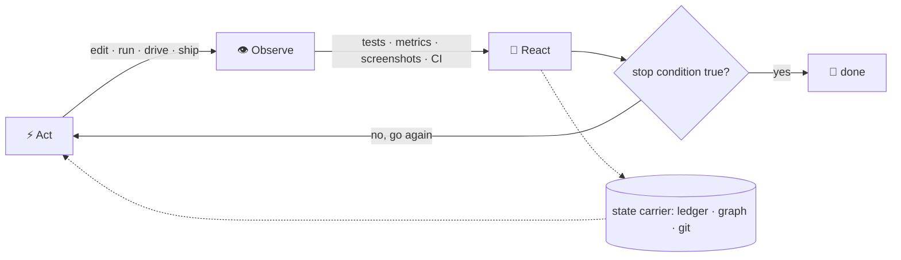
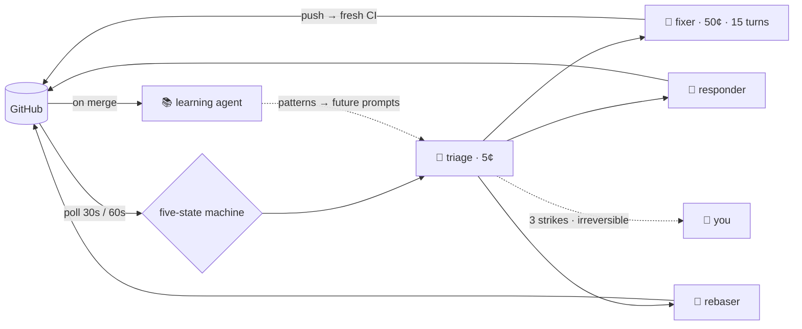
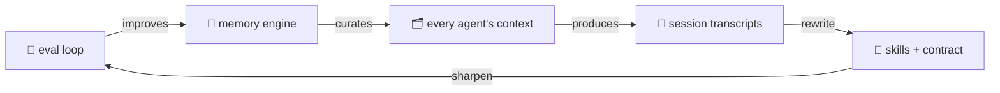

For the past week, an agent has been rewriting the retrieval system inside my memory engine. So far it has designed its own deterministic scorer, run eleven experiment arms, and retired five of my favorite hypotheses because they couldn't survive replication. The idea that did survive has shipped across seven commits. I wrote one prompt at the start and have made a few calls along the way. The loop is doing the rest, and it isn't done.

![[wide] A developer stands back from their desk holding a coffee, watching a ring of holographic terminal panels orbit above the chair, each panel feeding a ribbon of light into the next in a continuous glowing cycle, with a single thin thread of light connecting the ring to the developer's hand.](/images/blog/loop-engineering-hero.webp 'The loop runs itself. The steering thread stays in your hand.')

At 3:30 every morning, another model wakes up to a standing instruction I wrote once and never send. It reads what my agents captured yesterday, decides what's worth keeping, promotes the confident findings into a knowledge graph, and routes the uncertain ones to me. Nobody is awake. The system is prompting itself.

And in one five-day stretch last month, a PR babysitter I built ran 1,785 agent sessions against my open pull requests. Poll, classify, dispatch, fix, learn, repeat. The peak day hit 505 sessions, and my involvement was approving the occasional push.

None of this is a demo rigged for a launch video. It's just what my tooling looks like now, and there's finally a name for the discipline behind it.

## 🌀 The Name Finally Caught Up

In June the term **loop engineering** landed. Peter Steinberger [put it in twelve words](https://x.com/steipete/status/2063697162748260627): "you shouldn't be prompting coding agents anymore. You should be designing loops that prompt your agents." Addy Osmani [named the practice](https://addyo.substack.com/p/own-the-outer-loop) a day later and gave it an anatomy; O'Reilly [republished the essay](https://www.oreilly.com/radar/loop-engineering/) two weeks after that, which is how you know a term has officially arrived. Boris Cherny, who created Claude Code, summed up the vibe: "I don't prompt Claude anymore."

The lineage is clean. Prompt engineering was about the words. [Context engineering](/blog/2026.01.26_context-engineering) was about what the model can see. Harness engineering was about the tools and permissions around it. Loop engineering is about what happens _between_ runs: the trigger, the feedback signal, the state that carries forward, and the rule that decides when it stops.

This post is the third act of a trilogy I didn't know I was writing. [In January](/blog/2026.01.26_context-engineering) I wrote about engineering the context. [In May](/blog/2026.05.27_how-i-ai) I wrote about the operating system underneath my prompts: a contract, a skill library, a memory graph. This one is about what happens when that operating system starts running itself.

One receipt for how convergent this moment is: while mining my own session archive for this post, an agent found the original wish for my memory consolidation loop, timestamped April 4. Verbatim: "i really want a dream mode for claude code. like something that reviews all our conversations regularly." Two months before anyone named the practice. If you've been working seriously with agents, you've been converging on the same ideas. The name doesn't unlock anything; it just gives us a shared vocabulary, and something to argue about on the timeline.

And it is a craft. The hype-cycle version of loop engineering is "put the agent in a while-loop and go to bed." The real version is closer to control theory than to prompting, and the difference between a loop that compounds and a loop that burns tokens is a handful of design decisions nobody puts in the launch tweet.

## ⚡ Act → React: The Core Mechanic

Strip away the tooling and every loop is the same three-beat cycle:

1. **Act.** The agent does something real: edits code, runs an experiment, drives a browser, opens a PR.
2. **Observe.** The world answers with a signal: a test result, a metric, a screenshot, a review verdict, CI going green or red.
3. **React.** The loop, not a human, feeds the signal back into the agent's context, and the next act is shaped by it.



That third beat is the entire discipline. A prompt is a one-shot context delivery: you curate what the model sees, it acts, done. A loop is a _context engine_. Every iteration curates what the next iteration sees, automatically, from the results of the last one. The agent is feeding itself. Your job moves up a level: you're not writing the context anymore, you're designing the machinery that generates it.

Which means the quality of a loop is exactly the quality of four components:

**The feedback signal.** What does the loop observe after acting? This is where most loops fall apart. A signal that's cheap, deterministic, and dense beats an expensive vague one every single time, because the loop consumes it on every iteration. Tests are great signals. Typed metrics are great signals. "The output looks better" is not a signal, it's a vibe, and a loop steered by vibes is a random walk.

**The state carrier.** What survives between iterations? The model's context window doesn't. It fills, it compacts, it's gone when the session ends. Loops that compound carry state outside the model: a findings ledger, a journal file, a task board, a knowledge graph, git history itself. The agent forgets; the repo doesn't.

**The stop condition.** When is it done? "When it's good" is not a stop condition. A testable predicate is: tests green, findings count at zero, metric above threshold, budget exhausted, human says ship.

**The safety rails.** Budgets, cooldowns, dedupe, escalation. The unglamorous engineering that makes an unattended loop survivable. More on this later, because in my experience it's most of the actual work.

Everything that follows is the same four components rearranged.

## 🧪 The Eval Loop: An Agent Running Real Science

The best loop I've run this year is still running while I write this: an experiment campaign against [Sibyl](https://github.com/hyperb1iss/sibyl), my memory engine, on the LongMemEval v2 benchmark, because v1 is saturated to the point that a good score is table stakes rather than signal. A week in, it already shows what act → react looks like when the feedback signal is engineered instead of vibed.

The question: when Sibyl pulls memories for a model, does changing how many it grabs and how it lays them out on the page actually get more _answers_ in front of the model?

The agent's first move was the one that made everything else work: **it built itself a deterministic scorer.** Instead of asking an LLM judge "did this retrieval look good?" on every iteration (slow, noisy, expensive), it wrote a script that checks whether the known-correct answer literally appears in the assembled context. That check is cheap, exact, and instant, and every configuration got a real number in seconds:

```
exposure 14/23 ( 60.9%)  phrase-hit  66.7%  ctx  36.9K avg
exposure 15/23 ( 65.2%)  phrase-hit  69.7%  ctx  35.8K avg
exposure 16/23 ( 69.6%)  phrase-hit  69.7%  ctx  47.8K avg
```


Then the loop proper. The plan said six experiments; the results kept suggesting new ones, and the list has grown to eleven so far, because that's what loops do. Each experiment ran in the background and could crash and resume where it left off, and the agent slept until a results file (or a stack trace) showed up to react to.

The surprise came from scoring two things separately: whether search _found_ the right memories, and whether the layout actually got them onto the page. Search was already finding 82.6% of the answers; the layout only got 65.2% of them in front of the model. The bottleneck wasn't search at all. It was page layout. I would not have guessed that, and neither did the agent: the loop measured its way there.

One change looked like a clear win. Instead of shipping it, the loop did the thing that separates engineering from enthusiasm: it ran the same experiment three more times and compared results question by question. The win evaporated: the average had been sitting still while individual questions churned underneath it. Single runs lie. Five plausible improvements were retired this way, each with receipts.

The sixth idea survived: have a tiny, cheap model write a short digest of every memory as it's stored, about fifteen cents for the whole corpus. Replicated effect: **+6.67 points, nine questions better, two worse.** Then it flunked its first test on a different kind of data, the agent worked out why (the digest was reading fields that didn't exist there), fixed it, and passed the rerun.

Seven commits have landed on the repo so far, and the campaign is still running as this post goes up. The eval loop is rewriting the system it's evaluating, live.

The transferable lessons, because your version of this won't be a memory benchmark:

- **Build the cheap scorer first.** One hour spent making feedback deterministic pays back on every iteration. LLM judges belong at the _end_ of a loop, not inside it.
- **Make iterations resumable.** Experiments that can crash and resume turn an overnight failure into a delay instead of a loss.
- **Replicate before you believe.** N=1 results are noise wearing a costume.
- **Retire hypotheses with receipts.** A loop that only confirms is a yes-machine. Five documented rule-outs bought the credibility of the one win.

## 🎭 Visual Verification: The Loop Got Eyes

The loop upgrade that still feels like magic: agents can _see_ now, and seeing closes feedback cycles that used to require a human on every iteration.

The modern setup: the agent drives the running app in a real browser, the rendered surface itself rather than the test suite. It navigates, clicks, fills forms, and screenshots. The screenshot is the observe beat. The agent compares what it sees against the acceptance criteria, fixes, re-renders, looks again. For UI work I'll write something like "the cards align to an 8px grid, the hover state doesn't shift layout, dark mode holds contrast" and let the loop iterate itself there, screenshot by screenshot. A year ago this was "make the change, describe it to me, I'll look." Now the agent is the one looking, and it catches the 2px misalignment I would have missed.

The same pattern runs end-to-end tests as a loop signal: drive the app, assert on what actually rendered, feed failures back as context. And it composes with everything else in this post. A review loop where the reviewer _also_ drives the app catches a class of bug no diff-reader ever will.

One rule keeps these loops honest, learned the expensive way and now written into my skill library: **perf and visual loops need an objective signal before iteration two. Loops judged by the next screenshot become random walks.** The screenshot is the sensor, not the standard. Pin the standard first (named acceptance criteria, a reference design, a metric, a golden snapshot) and let the screenshots measure against it. An agent iterating toward "looks better" will happily wander forever, each iteration convincingly justified.

When the surface is one the agent can't observe, the first move is building the connector, because most "unobservable" surfaces are just missing a driver. Terminals get automation harnesses like [ghostty-automator](https://github.com/hyperb1iss/ghostty-automator) or cmux that drive keystrokes and read the screen back. Machines beyond the laptop get an agent over SSH. A drawer full of Android devices becomes a sensor array with an MCP server like [droidmind](https://github.com/hyperb1iss/droidmind) pushing input and pulling screenshots from every one of them. Each connector converts a blind spot into a feedback signal, permanently, for every loop you build afterward.

And when the surface genuinely can't be instrumented (how a terminal _feels_, the light coming off actual hardware), the loop still doesn't end. The human becomes the sensor: hand them a pre-registered expected outcome and a discriminating tell, and you're still running act → react. You've just got a slower sensor with better taste.

## 🔮 Review Loops: Convergence You Can Graph

The loop I run most often is cross-model review to convergence, and the state carrier is what makes it more than "ask another model twice."

The shape: one model produces an artifact. A spec, a plan, a diff. A different model reviews it adversarially. The findings go into a **ledger** that travels between rounds: every finding verbatim, the claimed fix, the commit SHA of the fix. The next round's reviewer gets the ledger and two jobs: verify each claimed fix actually landed, and hunt for new problems the fixes introduced. The artifact and its ledger _are_ the loop's memory. The agent is feeding itself its own review state.

You track convergence numerically, and the numbers tell you things. A recent infrastructure plan of mine converged over twelve rounds:

```
17 → 9 → 8 → 4 → 3 → 2 → 1 → 1 → 4 → 1 → 1 → PASS
```


See round nine? Four new findings after two quiet rounds, because the round-eight fixes broke new ground. Convergence isn't monotonic, which is exactly why you graph it instead of trusting your sense that "it's probably fine now." Another spec went 19 → 6 → 4 → 2 → 0 in five rounds. When the trend stalls or oscillates, the loop is telling you the remaining findings are matters of judgment, and judgment is the human's job.

The community has been circling the simplest form of this for a while: implement, review, fix, repeat, sometimes with a hook that re-feeds the same prompt until the work is done. Fine as far as it goes. But the naive version has a failure mode that only shows up in production use: **not all review loops should stop the same way**, and treating them uniformly either burns tokens or ships defects. What I've converged on:

- **Code review: cap the re-litigation, not the rounds.** Three visits to the _same finding_ means you're in an argument, not a review. But rounds that keep surfacing new confirmed defects keep going.
- **Spec review: iterate until you love it.** Spec defects are the most expensive class of defect there is, so convergence is the only exit. My standing instruction to the loop is literally "iterate until we love it."
- **Fix passes: pre-declare a file budget.** Review-fix loops are a monotonic scope ratchet; every round wants to touch a few more files. I've watched one hit 8 rounds and 63 files before we re-anchored it to six. Now the budget gets declared before round one.

Two independence rules, both non-negotiable. The implementer never self-assigns PASS, because the model that wrote the code is too kind grading its own homework, and so is the same model re-reading it. And a verdict is pinned to a SHA: any commit after the reviewer's pass voids the pass. Warm-resuming the same reviewer speeds up fix-round convergence; a fresh-context reviewer does final certification precisely because it inherits nothing.

## 🛠️ The Babysitter: 1,785 Sessions in Five Days

Vigil is a PR babysitter I built this spring: an agent system that watches my open pull requests and does whatever they need next. In its first real production window it ran 1,785 agent sessions in five days, every one of them against my real PRs.

The loop: pollers watch GitHub (my PRs every 30 seconds, the wider radar every 60). State changes get classified by a five-state machine (hot, waiting, ready, dormant, blocked) and classified events go to a cheap triage agent with a five-cent budget that routes to specialists: a fixer with a fifty-cent budget and 15 turns, a responder for review comments, a rebaser, an evidence gatherer. A fixer pushes a commit, the next poll sees fresh CI, triage re-routes. The loop continues until the PR hits READY.



What the architecture diagram doesn't show: **the loop logic is maybe a fifth of the code. The rest is safety rails.**

- Per-agent turn caps and dollar budgets, per run.
- Event dedupe with a five-minute window, plus a 45-second cooldown per event type, because GitHub will happily tell you the same thing four times.
- A concurrency gate so two agents never work the same PR simultaneously.
- Prompt fingerprinting that flags when an agent is about to ask the same question it asked five minutes ago. That's the observability hook for loop detection.
- Escalation: three consecutive failures on the same thing and it stops looping and pings the human.
- Auto-approve for everything except the irreversible set: push, merge, branch delete. Reversible actions flow; irreversible ones queue for me.


There's also a second, quieter loop stacked on the first. On every merge, a learning agent extracts patterns into a knowledge file ("this reviewer usually asks for type annotations on public APIs, confidence 0.70"), and new patterns start at 0.50 confidence and gain +0.10 on each reconfirmation. The whole file gets injected into future triage and fix prompts. Every PR makes the next one smoother. The loop's output has become the loop's context, and that's the move that compounds.

To be fair, you no longer need to build any of this yourself just to get your PRs babysat. Codex and Claude are both solid PR watchers out of the box now, and with newer models you can hand one an entire stack: a PR goes up, a bot review posts feedback, human engineers post theirs, and the agent reads it all as it lands, updates the PR, and replies to the comments with a summary of what changed. What the off-the-shelf version doesn't ship is everything around the loop: the budgets, the dedupe, the learning file, and the queue of irreversible actions that waits for a human.

If you build one loop this year, build a babysitter for something you already poll by hand that nobody has productized yet. The design pressure is fantastic: every safety rail above exists because its absence produced a specific, memorable mess.

## 🌙 Loops That Feed the Loops

The layer above all of this is where it gets properly recursive: loops whose output is the _context machinery itself_.

**Consolidation runs nightly.** Sibyl's dream cycle wakes at 3:30am, reads what my agents captured during the day, and applies a hard policy: findings it's confident about promote into the knowledge graph automatically, anything it's unsure of queues for me, and duplicates and stale entries get archived. Every agent's tomorrow-context is being curated by an unattended model run tonight, gated by policy.

**Forgetting is a loop too.** Every recall an agent makes stamps usage counters on the entities it retrieved. A nightly decay job consumes those counters: memory that gets used survives, memory that doesn't fades and eventually archives. Reads are the training signal for retention. The knowledge graph is under continuous selection pressure from the swarm's actual behavior. I don't garden it; the usage gardens it.


**And once a season, the big one.** In July I pointed one prompt at my entire session archive: "review the last few months of Claude and Codex sessions and mine all the patterns and good stuff that worked." What ran: five chained workflows, 208 subagents, two hours and fifty-three minutes. Sixty-two readers worked through distilled versions of ~600 sessions (about 8GB of raw transcripts), pulled out 1,883 findings, merged them into 221 patterns, and then eleven editor agents with adversarial verifiers rewrote my skill library and my agent contract _from the evidence of their own use_. The loop system audited itself and shipped the patch.

My favorite finding from that run, mined from months of my own sessions: **"Rules don't self-enforce at generation time; checkpoints do."** Written by an agent, about agents, from watching agents. The instruction you put in the prompt is a hope; the verification beat you build into the loop is a guarantee.

That's the full stack of self-feeding: the eval loop improves the memory engine, the memory engine improves every agent's context, the agents' transcripts improve the skills, and the skills improve the loops. Each layer's exhaust is the next layer's fuel.



## 🎯 Proof at Scale: Bun's Rust Rewrite

Everything above ran on my laptop against my projects. If you want evidence that the same discipline holds at three orders of magnitude more scale, May was happy to oblige: [Bun rewrote itself from Zig to Rust](https://bun.com/blog/bun-in-rust). 535,496 lines of Zig across 1,448 files became a 1,009,272-line Rust diff in eleven days, built by 64 Claude agents running continuously, for about $165,000 in API-priced tokens. Jarred Sumner's estimate of the manual alternative: three engineers with full codebase context, about a year.

Jarred published the core of the system as pseudocode, and it's the act → react cycle verbatim:

```ts
let task
while ((task = todoList.pop())) {
  const result = task()
  const feedback = await Promise.all([review(result), review(result)])
  await apply(feedback, result)
}
```

Act, observe twice in parallel, react. And every component from the anatomy section is there at industrial strength:

**The feedback signal** is the whole story. Bun's test suite is written in TypeScript, which means it's independent of the runtime's implementation language: 1,386,826 `expect()` calls on Linux x64 alone, roughly 60,000 tests per platform, functioning as a conformance suite for the port. When the tests pass, the port is correct, and no LLM judge has to opine. During the compiler-error phase (16,000 errors at the start), the loop was literally "run `cargo check`, group the output by file, save the errors to a file, fix all the compiler errors within that crate." Deterministic, dense, cheap.

**The state carrier** was built before the loop ran: three hours producing a PORTING.md (600 lines of Zig-to-Rust pattern mappings, with hard constraints like no tokio, no async/await, because Bun owns its own event loop) plus a LIFETIMES.tsv mapping the ownership of every struct field. Both documents got their own adversarial review before any code generation started. Context engineering feeding loop engineering.

**Independence was structural.** One implementer, two adversarial reviewers per task, and the roles never blur: "The implementer doesn't review. The reviewer doesn't implement." Reviewers got only the diff and were told to assume the code is wrong. Every line of the million-line diff crossed two adversarial readers at a peak throughput of 1,300 lines per minute.

**The rails were physical.** Four git worktrees with 16 agents each, so shards couldn't touch each other's files. Agents banned from `git stash`, `git reset`, anything that doesn't commit a specific file. The stop condition had integrity teeth: 100% of the suite passing with zero tests skipped or deleted, because a loop that's allowed to delete failing tests will absolutely delete failing tests.

The most instructive moment is the failure. Mid-run, agents started interpreting "get all the crates to compile" as "stub out the functions": the classic false-victory pathology, at scale. The fix wasn't hand-editing stubs. It was one prompt edit, and the stubbing stopped fleet-wide. Jarred's summary of the methodology is the cleanest one-line definition of loop engineering I've seen: a million-assertion test suite, adversarial review, and **"when something does go wrong, fixing the process that generates the code instead of hand-fixing the code."**

Not everyone applauded. Zig's creator [called it "unreviewed slop"](https://www.theregister.com/devops/2026/07/14/zig-creator-calls-buns-claude-rust-rewrite-unreviewed-slop/5270743), and 6,502 commits in eleven days is a real review-debt question no matter how adversarial the machine reviewers were. The preconditions were also unusually good: an expert who knew every corner of the codebase steering daily, and a test suite that took years of runtime development to accumulate. That's the lesson, not a caveat to it. **The rewrite took eleven days because the feedback signal took years.** Your test harness is the asset your future loops will spend.


## 💎 The Craft: What Separates a Loop from a while(true)

Distilling everything above, plus a couple of years of expensive mistakes, into the principles I'd actually defend:

**Size the loop to the work.** Loop engineering earns its keep in two places: greenfield scope too big to hold in your head (new builds, ports, benchmark campaigns) and toil that recurs forever (PR queues, nightly digests). A small task or a routine debugging session doesn't want a harness; the setup never pays back, and the ceremony slows down work you could have just done. The exception is the verify loop, which is free and belongs everywhere.

**Type your stop conditions.** Different loop species stop differently, and using the wrong stop rule is the classic failure:

| Loop species      | Stop rule                                                  | Why that one                                                                 |
| ----------------- | ---------------------------------------------------------- | ---------------------------------------------------------------------------- |
| Spec review       | Convergence: iterate until you love it                     | Spec defects are the most expensive class there is                           |
| Code review       | Re-litigation cap: three visits to one finding             | New confirmed defects keep rounds alive; arguments don't                     |
| Research          | Yield: a wave that surfaces nothing new is the last        | Count-based stops miss the tail in both directions                           |
| Digests           | Cron: the schedule is the stop                             | The job is cadence, not convergence                                          |
| Exploration       | Budget: turns or dollars, pre-declared                     | Open-ended search needs a wall set before it starts                          |
| Self-re-prompting | A completion predicate that can only be emitted truthfully | "Blocked cleanly, with receipts and a runbook" is terminal; fake-done is not |

**Engineer the feedback signal like it's the product.** Deterministic beats judged, dense beats sparse, and cheap beats expensive, because the loop pays the cost on every iteration. The geometry sweep worked because the scorer was exact; vigil works because CI and GitHub state are unambiguous; visual loops work when the acceptance criteria are named before iteration one.

**Carry state outside the model.** Ledgers, journals, knowledge graphs, git history. The context window is a scratchpad, not a database. Every loop that compounds does it through external state; every loop that plateaus is usually re-deriving what it knew yesterday.

**The dominant failure mode is stopping early, not running away.** Everyone fears the runaway loop; in practice the pathology you'll actually fight is the agent quietly declaring victory: the plan-only exit, the false "all done!" on an empty turn, the wrap-up reflex as context fills. I spent a research cycle on this while building a swarm harness, and the design answer is a watchdog that distinguishes _stalls_ from _stops_: re-prompt on stall, replan on no-progress, and break the loop only on a repeated failure signature. Pair it with turn and dollar budgets and you've bounded both tails.

**Run the accumulation test before any overnight loop.** Ask one question: does progress _accumulate_ between iterations? An overnight loop without a merge path doesn't produce a feature, it produces a pile of parallel worktrees. If each iteration doesn't land somewhere durable that the next iteration builds on, fix that before you scale the iterations.

**Independence is structural, not aspirational.** The implementer never self-assigns PASS. Verdicts pin to SHAs. Final certification gets fresh context. None of this is about model quality; it's about the same conflict-of-interest logic we already apply to humans.

**Budgets and rails are the job.** Turn caps, dollar caps, dedupe windows, cooldowns, same-target concurrency gates, escalate-after-N-failures, auto-approve-reversible-only. Boring, essential, and roughly 80% of the code in every loop I've kept.

## 🌸 Start With One Loop

You don't need my stack. You don't even need a special harness: every loop in this post runs on stock agent CLIs, Claude Code or Codex, sometimes Pi or OpenCode, with small scripts and cron holding the loops together. The agents are ordinary sessions; the engineering is in what surrounds them, and all of it is portable. In rough order of payback:

**1. The verify loop (start today).** Edit → test → fix, every two or three edits, enforced as loop structure rather than discipline. This is the smallest act → react cycle that exists and it's the foundation everything else stands on. If your agent ships "fixed it" without a test run in the same session, you don't have a loop, you have a hope.

**2. The review-to-convergence loop (this week).** Next spec or meaty diff: have a _different_ model review it, keep a findings ledger, fix, re-review, and track the count. Watch it converge, or watch round nine surprise you. Stop conditions per the craft section: convergence for specs, re-litigation caps for code.

**3. The scheduled digest (this month).** One recurring report you currently assemble by hand: last week's merges, your open review queue, error trends. Cron a session, give it a fail-closed preflight, gate delivery behind a fact-check pass. This is your intro to loops that run when you're not watching, with training wheels: worst case is a bad report to yourself.

**4. The babysitter (when the polling pain is real).** Pick the thing you check compulsively (a flaky CI pipeline, a long-running migration, your PR queue) and wrap a poll → classify → act loop around it, with the full rail kit: budgets, cooldowns, dedupe, escalation, irreversible-actions-queue-for-human.

**5. The memory loop (when the others are humming).** Scheduled consolidation of your sessions into durable, recallable knowledge, with a confidence gate between the unattended run and what your future agents get to see. This is the one that makes the other four compound.

And measure the loop, not the vibes: iterations to convergence, cost per iteration, unverified-claim rate, escalation rate, and how often the loop's stop condition fired versus you pulling the plug. A loop earning its keep shows up in those numbers within a week; a loop that doesn't gets deleted.

## 🦋 The Part That Stays Human

Osmani ends his essay warning against _cognitive surrender_, the temptation to stop having judgment once the automation feels smooth. It's the right warning. Every loop in this post keeps a human where it counts: I pick the hypotheses the eval loop tests, approve the pushes vigil queues, review what the dream cycle isn't sure about, and make the judgment calls the review ledger converges toward. The loops removed the toil of re-prompting, not the steering. If anything, they concentrated the job into its highest-leverage form: designing feedback systems and exercising taste at their decision points.

Two years ago the craft was writing the perfect prompt. One year ago it was [engineering the context](/blog/2026.01.26_context-engineering). This spring it was [the contract, the skills, and the memory](/blog/2026.05.27_how-i-ai). Now the context engineers itself, on a schedule, from the results of its own actions, and the craft moved up another level: act, react, repeat, with you designing the loop and keeping the judgment.

Don't just prompt. Engineer the loop. Iterate until you love it. 💜
